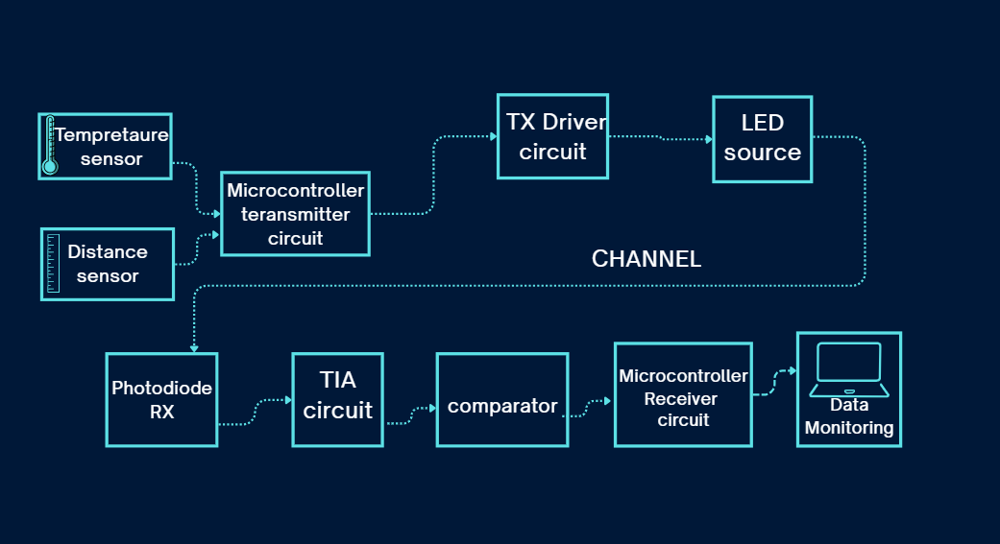
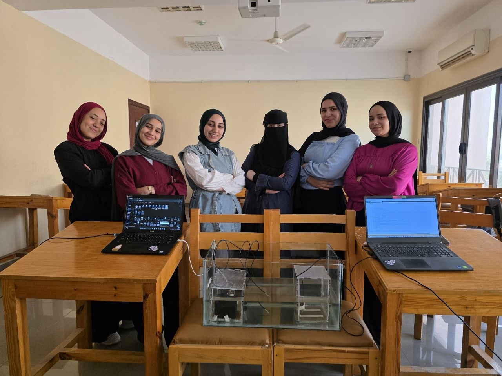

# Blue-Green OptiCom


Blue-Green OptiCom is a complete end-to-end underwater optical communication system developed from scratch. The embedded transmitter collects environmental sensor data using an ESP32 microcontroller, applies Manchester encoding and On-Off Keying (OOK) modulation, and transmits the information through a green LED optical source. A custom photodiode-based receiver, including a transimpedance amplifier (TIA) and signal conditioning circuitry, detects the optical signal, recovers and decodes the transmitted data, reconstructs the original measurements, and displays them in real time on a monitoring interface.


## 📡 System Overview

The following block diagram illustrates the architecture and data flow of the complete underwater optical communication system.

<p align="center">
  
</p>

<p align="center">
  <em>Figure 1. End-to-end architecture of the Blue-Green OptiCom system.</em>
</p>

## Features

- OOK (On-Off Keying) modulation
- Manchester encoding
- Green LED optical transmitter
- Underwater optical link simulation using OptiSystem
- Photodiode + TIA + Comparator receiver
- ESP32-based transmitter and receiver
- Environmental sensor transmission
- PCB-based hardware implementation

## Repository Structure

```
Blue-Green-OptiCom/
├── Code/
│   ├── Transmitter/
│   └── Receiver/
│
├── Simulation/
│   ├── Proteus/
│   └── OptiSystem/
│
├── Documentation/
│   ├── Report/
│   ├── Presentation/
│   ├── Images/
│   ├── Videos/
│   └── PCB/
│
└── README.md
```

## Hardware

- ESP32
- Green LED Array
- Photodiode
- Transimpedance Amplifier (TIA)
- Comparator
- Power Supply

## Simulations

- Proteus
- OptiSystem

## Project Demonstration

Project photos and demonstration videos are available in:

```
Documentation/Videos
Documentation/Images
```

## Team

This project was developed by:

- Team Members:
- Nada Ehab Fathy Zaky Ghorab               
- Manal Nabil Ahmed Donia    
- Naglaa Osama Fathy Ahmed Ebrahim                    
- Maryam Ebrahim Ali Ebrahim zina               
- Malaka Abdellatif Youssef                    
- Naira Amer Mohamed Ghazy El-Zenary
- Gomaa Ismail Gomaa

<p align="center">
  
</p>

<p align="center">
  <b>Thank you for visiting our project! ⭐</b>
</p>